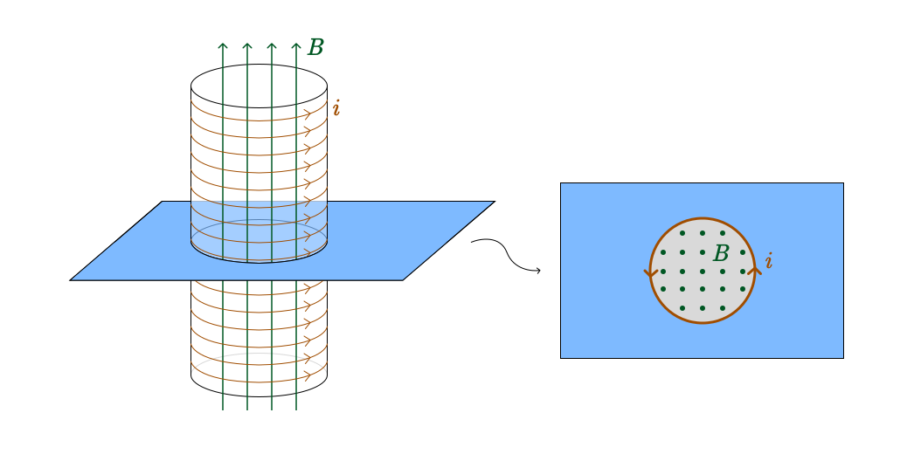

# 二维电磁场的基本理论

熊桐睿

**摘要:** 三维电磁场的性质已经被研究得比较清楚，而目前对于二维空间的电磁场研究不多。对二维空间的电磁场研究具有重要意义，可以应对“二向箔”攻击，帮助主动移民二维空间和创造二维虚拟世界。本文研究了与人类当前所处的三维空间具有相同基本性质的二维空间的电磁场。以不受维度影响的最基本的电磁理论作为基本假设，即从叠加原理、高斯定理、环路定理出发，推导出库仑定律的一次方反比形式和泊松方程。在磁学方面，本文论证了二维磁场退化为了标量场。类比与三维的安培环路定理，本文推导了二维磁场的跨路定理，再通过数学推导得到跨路定理的微分形式，从而得到二维电磁场的麦克斯韦方程组和电磁震荡的波动方程。最终本文得出了自洽的二维电磁学公式，它们具有良好的数学结构且可以和人类当前所所处的三维空间的电磁学公式相对应，这也佐证本文基本假设的合理性。

**关键词:** 二维空间，电磁场，基本理论

**ABSTRACT:** The properties of three-dimensional electromagnetic fields have been well-studied, while current research on two-dimensional electromagnetic fields is scant. The study of two-dimensional electromagnetic fields is significant, which can deal with "two-dimensional foil" attacks, facilitate active immigration into two-dimensional spaces, and aid in creating two-dimensional virtual worlds. This paper investigates the electromagnetic fields of two-dimensional spaces which share fundamental properties with the three-dimensional space that humans currently inhabit. Employing electromagnetic theory that is unaffected by dimensions as the basic assumption, i.e., starting from the superposition principle, Gauss's law, and loop theorem, we derive the inverse square form of Coulomb's law and Poisson's Equation. In magnetism, this paper proves that two-dimensional magnetic field strength is scalar, and the two-dimensional magnetic field is a scalar field. Analogous to Ampere's loop theorem in three dimensions, we formulated the cross-route theorem for a two-dimensional magnetic field, then via mathematical derivation, we obtained the differential form of the cross-route theorem, leading to the Maxwell's equations for the two-dimensional electromagnetic field and the fluctuation equation for electromagnetic oscillations. In conclusion, this paper presents self-consistent omulations of two-dimensional electromagnetism. They possess sound mathematical structures and can correspond to the formula of three-dimensional electromagnetism presently understood by humans, which reaffirms the legitimacy of the basic assumptions made in this paper.

**KEYWORDS:** Two-dimensional space, electromagnetic field, basic theory

## 引言

电磁学具有悠久的研究历史。自1820年丹麦科学家汉斯·奥斯特发现电流产生磁场，开启了电磁学研究以来，1831年法拉第发现电磁感应现象，为电力应用奠定了基础。随后，麦克斯韦在1860年代提出电磁场理论，并预言了电磁波。1888年赫兹实验验证了电磁波的存在。20世纪初，电磁学与量子力学和相对论相结合，进一步推动了物理学的发展。迄今为止，三维电磁理论已经非常完善，几乎所有三维的电磁现象都可以用现有理论进行解释。

人类生活在三维空间，因此目前的电磁理论主要针对三维空间的，而对于二维空间的电磁理论研究很少。这一方面由于二维空间距离现实生活较远，对二维空间电磁理论的研究价值目前不如对三维空间的研究，另一方面则是由于人类无法进入二维空间进行实验，对于二维空间的理解不够深刻。然而，对于二维空间的电磁学研究在如下三个方面具有要意义：

一、人类有遭到“二向箔”攻击的可能。《三体》中描述的二向箔\[1\]是一种超维度武器，能将三维空间压缩至二维平面，具有毁灭性效果。遭受攻击后，三维世界中的电磁现象将会发生变化，现有的三维电磁理论将不再使用，电子设备将失效，人类生活将受到严重影响。研究二维空间的电磁理论，有助于在受到二向箔攻击时，更快地重新构建电磁理论，设计新的电子设备，适应新的生存环境。因此，率先掌握二维电磁理论的国家或文明将更快地恢复生产力，得到领先优势。

二、人类有主动移民二维空间的可能。二维空间相比三维空间可能有消耗能量更低，资源更丰富，环境更稳定等优势。虽然目前没有科学证据支持这些说法，但也不能排除二维空间具有优越性的可能。因此未来人类有可能主动移民二维空间。在这种情况下，对二维电磁理论的研究将变得尤为重要，有助于人类更好地适应二维空间的生存环境，发展新的科技，推动文明进步。

三、人类有创造二维虚拟世界的可能。随着计算机技术的发展，人类有可能创造出二维虚拟世界，用于娱乐、教育、科研等领域。在二维虚拟世界中，电磁现象是虚拟的，但也需要有一套完整的电磁理论来描述。研究二维空间的电磁理论，有助于人类更好地理解二维虚拟世界中的电磁现象，设计更加逼真的虚拟环境，提高虚拟现实技术的水平。

因此，研究二维空间的电磁理论具有重要意义。由于无法直接进入二维空间进行实验，本研究主要采用纯理论推导的方式，构建了在基本性质上与人类当前所处的三维空间有相同基本性质，且自洽的二维电磁场理论。包括了二维电磁场的叠加原理、二维静电场的高斯定理、二维静电场的环路定理、二维静电场的泊松方程、二维电磁感应、二维电磁震荡等基本方程。并通过数值模拟，展示了二维电磁场的一些典型图像。

## 方法

### 基本方法

本研究考虑的二维空间为人类当前所处世界的二维情况，而非任意的二维空间。因此，本文所研究的二维空间在基本性质上与人类当前所处的三维空间一致，只是空间维数不同。如电磁学中的电荷、电场、磁场等基本概念在二维空间中的定义与三维空间中的定义相同。这样做的目的是为了保证我们的研究具有普适性，能够应用于人类当前所处的三维空间。

### 二维电磁场的叠加原理

三维电磁场中的叠加原理是指，多个电荷产生的电场在空间中产生的电场、电势可以直接相加。这体现了电场的线性性质。由于本文讨论的二维空间除空间维数与人类当前所处的三维空间不同以外，在不产生矛盾的情况下，应假设其他性质与三维空间相同。因此，二维空间中的电磁场也应满足叠加原理。

### 二维静电场的高斯定理

三维静电场中的高斯定理，是指任意闭合曲面（或称高斯面）$S$ 的电通量等于该面内全部电荷的代数和除以介电常数，与外面的电荷无关\[2\]。该定理描述了电场的基本规律之一，应当具有普适性。在二维空间中，应当也存在与之对应的“二维静电场的高斯定理”。由于本文研究的二维空间在基本性质上与人类当前所处的三维空间相同，仅可以假设高斯定理在不可能与维数相关的部分仍然适用。即，通过闭合曲线的电通量仅与曲线内部电荷有关，而与曲线的具体形状和内部电荷分布情况无关：

$$
\oint_L \vec E\cdot d \vec n=f(q)
$$

其中，$\vec E$ 为电场强度，$d \vec n$ 为曲线上的微元法向量，$q$ 为曲线内部的电荷量，$f$ 为待定函数。

显然，在$q=0$的情况下，上式为0，即：

$$
f(0)=0
$$

另一方面，对于包含多个电荷的情况，由于电场满足叠加原理，故：

$$
\oint_L \vec E\cdot d \vec n=\sum_i f(q_i)
$$

因此，$f$ 必须满足线性关系：

$$
f(q) = c_1 q
$$

故二维静电场的高斯定理即为：

$$
\oint_L \vec E\cdot d \vec n = c_1 q
$$

其中，$L$ 为任意闭合曲线，$\vec E$ 为电场强度，$d \vec n$ 为曲线上的微元法向量，$q$ 为曲线内部的电荷量，$c_1$ 为待定常数。$c_1$ 应由实验测量确定，不在本文的研究范围内。

### 二维静电场的环路定理

三维静电场中的环路定理是指，电场的环路积分为0。这体现了电场的无旋性质。在二维空间中，应当也存在与之对应的“二维静电场的环路定理”。作为基本性质，本文假设环路定理在不可能与维数相关的部分仍然适用。即，电场的环路积分为0：

$$
\oint_L \vec E\cdot d \vec n=0
$$

其中，$L$为任意闭合曲线，$\vec E$为电场强度，$d \vec n$为曲线上的微元法向量。

### 二维静电场的库伦定律

在二维静电场的高斯定理中，由于$L$任意，可取一个圆形的高斯“环”$L$，其圆心处有一个点电荷$q$。由于本文研究的二维空间应当也具有各向同性，点电荷 $q$ 在环上产生的电场的径向分量应当相同。故：

$$
\oint_L \vec E\cdot d \vec n=E_r\cdot 2\pi r =c_1 q
$$

其中，$r$为圆的半径，$E_r$为点电荷在$r$处产生电场的径向分量。因此可以推出：

$$
E_r=\frac{c_1 q}{2\pi r} = \frac{k q}{r}
$$

即在二维静电场中，电场强度与电荷量成正比，与距离成反比。这与三维空间中的库伦定律中，电场强度与距离的平方成反比有所不同。

类似地，在圆环上应用二维静电场的环路定理，并考虑二维空间的各向同性，即电场的切向分量只可能处处相等的顺时针或逆时针分量，可以得：

$$
\oint_L \vec E\cdot d \vec n=E_\theta\cdot 2\pi r =0
$$

故

$$
E_\theta=0
$$

即二维空间中点电荷产生电场强度的切向分量为 $0$。故二维空间中的库伦定律为：

$$
\vec E = E_r \hat r = \frac{k q}{r} \hat r
$$

### 二维静电场的泊松方程

将二维静电场的高斯定理转化为微分形式，得到：

$$
\nabla \cdot \vec E = c_1 \rho
$$

又由于二维静电场的环路定理，即二维静电场是无旋场，故存在标量场 $\phi(x,y)$ 使得：

$$
\vec E = -\nabla \phi
$$

由此可得二维静电场的泊松方程：

$$
\nabla^2 \phi = -c_1 \rho
$$

该方程描述了二维静电场中电势 $\phi$ 与电荷密度 $\rho$ 之间的关系。除常数 $c_1$ 可能与三维空间中不同外，二维静电场的泊松方程与三维空间中的泊松方程相同。

### 二维静电场的模拟

根据上述推导的二维静电场的基本理论，可以进行二维静电场的模拟。以下是一些典型的二维静电场的模拟结果。其中图 1 中的等势面是正圆。

<Figure caption="图1 二维异号点电荷电场模拟">

</Figure>

<Figure caption="图2 二维同号点电荷电场模拟">

</Figure>

<Figure caption="图3 二维带电导体圆环电场模拟">

</Figure>

<Figure caption="图4 二维有限长均匀带电线电场模拟">

</Figure>

<Figure caption="图5 二维电容器电场模拟">

</Figure>

<Figure caption="图6 二维无限长带电线与点电荷电场模拟">

</Figure>

### 二维电流

二维空间中的载流子（如二维电子）在空间中运动时，即会产生电流。二维空间中的电流密度与三维空间中的电流密度具有类似的定义。即，单位截线长度上的电流量与单位时间的比值。二维空间中的电流是矢量，故可以分解为两个分量：

$$
\vec i = i_x \hat x + i_y \hat y
$$

而在二维空间中不存在 $j_z$ 分量。二维空间中电荷守恒定律仍成立，故电流密度同样满足电流连续性方程：

$$
\nabla \cdot \vec i = -\frac{\partial \rho}{\partial t}
$$

### 二维静磁场

二维静磁场和三维静磁场有显著的区别。在三维空间中，磁场是一个矢量场，每一点的磁场强度可能指向空间中的任何方向。而将此概念应用到二维空间中，会在三个方面产生问题：

- 二维空间中的电流无法产生方向处于平面内的磁场。不影响结论地，在三维中考虑一个平面作为研究的二维空间，则显然平面内的任何电流在平面内产生的磁场都没有平行于平面的分量，即，平面内的电流无法产生平行于平面的磁场。
- 假设二维空间中的电流于三维空间中的电流以相同的方式产生磁场，则二维空间中的磁场方向超出了二维空间的范围，无法在二维空间中以矢量的形式表示。
- 二维中的带电粒子在运动时，显然不可能受到第三个维度的力。若洛伦兹力仍然适用，方向在平面内的矢量磁场将会对平面中的带电粒子产生指向第三个维度的力，这是不合理的。

而将二维空间中的磁场以标量的形式表示，可以解决上述问题。即，二维空间中的磁场是一个标量场。每一点的磁场绝对值越大，表示该点的磁场越强。若一点的磁场绝对值为0，则表示该点的磁场不存在。磁场强度可能是正的，也可能是负的。

作为电磁场的基本性质，本文认为磁场强度满足叠加原理，即多个磁场源分别在各点产生的磁场强度可以直接相加，得到它们的合成磁场强度。这体现了磁场的线性性质。

### 二维电流的磁效应

在三维空间中，电流产生磁场的现象可由毕奥-萨伐尔定律和安培环路定理描述。其中，安培环路定理由毕奥-萨伐尔定律推导而来，而毕奥-萨伐尔定律由实验得出。由于不可能直接进入二维空间进行实验，一个合理的方式是将本文所研究的二维空间转化为受特殊约束的三维空间，并在三维空间中进行推导，再将结论转化为二维空间中的结论。

将任意的二维空间的电流分布在第三个维度上无限地复制，可以得到一个具有延 $z$ 轴平移对称性的三维空间。比如，二维空间的逆时针电流环在 $z$ 轴方向上无限延伸，将形成一个在三维空间中无限长且无线密的螺线管。根据三维空间的电磁场理论，可得在螺线管内存在只有 $z$ 方向分量的匀强磁场。这样的磁场分布同样具有延 $z$ 轴的平移对称性，故可以简单地截取三维空间中的一个 $xOy$ 平面，可以认为该平面上的磁场分布即反映了我们研究的二维空间中该电流环产生的磁场。

<Figure caption="图7 二维空间的电流分布在第三个维度上无限复制的示意图">

</Figure>

此处规定在三维空间中向上穿过平面的磁场在二维空间中描述为正值，反之，向下穿过平面的磁场在二维空间中描述为负值。故通过上面的例子，我们可以得到，二维空间中的逆时针电流环在环内产生大小处处相等的正磁场，环外产生大小处处相等的负磁场。

类似地，我们可以将二维空间中的无限长电流转化为三维空间中的无穷大载流平面，再截取一个平面，得到二维空间中的磁场分布。由此可得，无限长电流在它电流方向左侧区域产生无限大的匀强正磁场，右侧区域产生无限大的匀强负磁场。

<Figure caption="图8 二维磁场中的“跨路”定理" w-120 float-right>

</Figure>

根据以上推论，可以断定，二维平面中两点的磁场强度差值，只与这两点任意连线上穿过的各电流有关，与电流的具体形状无关。这与三维空间中的安培环路定理极为相似。类比三维中磁场的安培环路定理：

$$
\oint_{\partial S} \vec B \cdot d \vec l=\mu_0 \iint_S \vec j \cdot d \vec S
$$

规定 $d \vec{n}$ 指向积分方向的左手边，可以得到二维磁场中的“跨路”定理：

$$
B(\vec r_2)-B(\vec r_1)=c_2 \int_{\vec r_1}^{\vec r_2} \vec i \cdot d \vec{n}
$$

实际上，上式左侧可以看作对磁场的“零维积分”。这恰与三维中的安培环路定理相对应。

### 跨路定理的微分形式

在三维中，运用 Stokes 定理可以将环路定理微分化：

$$
\iint_S (\nabla \times \vec B) \ \cdot d \vec S=\oint_{\partial S} \vec B \cdot d \vec l=\mu_0\iint_S \vec j \cdot d \vec S\\
\implies \nabla \times \vec B=\mu_0 \vec j
$$

类似地，在二维中将跨路定理转化为微分形式：

$$
\int_{\vec r_1}^{\vec r_2}\nabla B \cdot d \vec l=B(\vec r_2)-B(\vec r_1)=c_2\int_{\vec r_1}^{\vec r_2} \vec i \cdot d \vec{n} \\
\implies \nabla B=c_2\, M\,\vec i
$$

其中，$M=\begin{bmatrix}
0 & -1 \\
1 & 0 \\
\end{bmatrix}$，是逆时针旋转 $90 \degree$ 的矩阵，$c_2$ 是一个待定的常数。

### 三维与二维电磁场的相似性

观察上文所得出的二维空间的电磁场基本定理，与已知的三维电磁场基本定理进行比较，可以发现它们具有显著的相似性：

|   | 三维空间 | 二维空间 |
| - | --- | --- |
| **电场高斯定理** | 电场二维积分 $\sim$ 电荷三维积分 | 电场一维积分 $\sim$ 电荷二维积分 |
| **磁场环路定理** | 磁场一维积分 $\sim$ 电流二维积分 | 磁场零维积分 $\sim$ 电流一维积分 |

这种相似性也印证了上述推导的正确性，也说明了本文研究的二维空间在基本性质上与人类当前所处的三维空间相同，而不是任意的二维空间。

### 二维静磁场的模拟

二维磁场的毕奥-萨伐尔定律如下：

$$
d \vec B=k\frac{I\cdot[(dl)_y(\hat {r})_x-(dl)_x(\hat {r})_y]}{r}
$$

通过观察模拟结果，可得毕奥-萨伐尔定律与跨路定理微分形式是自洽的。

<Figure caption="图9 圆形电流环产生的磁场模拟">

</Figure>

<Figure caption="图10 无限长直线电流产生的磁场模拟">

</Figure>

<Figure caption="图11 方形电流环产生的磁场模拟">

</Figure>

<Figure caption="图12 两个反向电流环产生的磁场模拟">

</Figure>

<Figure caption="图13 三条交叉无限长直线产生的磁场模拟">

</Figure>

<Figure caption="图14 三条平行无限长直线产生的磁场模拟">

</Figure>

### 二维的洛伦兹力

由于二维空间中磁场是标量场，故在二维中需要将三维空间的洛伦兹公式改写为：

$$
\vec F=q(\vec E+B\cdot M \vec v)
$$

### 二维的电磁感应

二维的电磁感应可以由与三维空间类似的推导得到。首先对电场旋度方程的微分形式进行变换。

一方面：

$$
\mathscr {E}=c_3 \frac{d \Phi}{dt}=c_3 \frac{d}{dt} \iint_D B dS=c_3 \iint_D \frac{\partial B}{\partial t}dS
$$

上式中，常数 $c_3<0$，这对应于楞次定律。

另一方面：

$$
\mathscr {E}=\oint_{\partial D} \vec E \cdot d \vec l=\iint_D (\frac{\partial E_y}{\partial x}-\frac{\partial E_x}{\partial y})dS
$$

于是得到：

$$
\frac{\partial E_y}{\partial x}-\frac{\partial E_x}{\partial y}=c_3 \frac{\partial B}{\partial t}
$$

然后对磁场的梯度方程进行变换。

变化的电磁场中，电流的连续性方程不再成立：

$$
\oint_{\partial D} \vec i \, \cdot d \vec {n} \neq 0
$$

而是有：

$$
c_2 \oint_{\partial D} \vec i \, \cdot d \vec {n}=-c_2 \frac{d}{dt} \iint_D \rho \ dS=-\frac{c_2}{c_1} \frac{d}{dt} \oint_{\partial D} \vec E \cdot d \vec {n}=-\frac{c_2}{c_1} \oint_{\partial D} \frac{\partial \vec E}{\partial t} \cdot d \vec {n}\\
\implies \oint_{\partial D} (c_2\vec i+\frac{c_2}{c_1} \frac{\partial \vec E}{\partial t})\cdot d \vec {n}=0
$$

所以二维电磁场的跨路定理应当被改写为：

$$
B(\vec r_2)-B(\vec r_1)=\int_{\vec r_1}^{\vec r_2} (c_2\vec i+\frac{c_2}{c_1} \frac{\partial \vec E}{\partial t})\cdot d \vec{n}
$$

转化为微分形式：

$$
\nabla B=M(c_2\,\vec i+\frac{c_2}{c_1} \frac{\partial \vec E}{\partial t})
$$

综上，电磁感应现象的方程可以表述为如下形式：

$$
\begin{aligned}
\nabla \cdot \vec E&=c_1 \cdot \rho \\
\frac{\partial E_y}{\partial x}-\frac{\partial E_x}{\partial y}&=c_3\frac{\partial B}{\partial t} \\
\nabla B&=M(c_2\,\vec i+\frac{c_2}{c_1} \frac{\partial \vec E}{\partial t})
\end{aligned}
$$

注意：这里将M写在括号外面，对电场也进行一个旋转是必要的，否则无法得到正常的电磁振荡形式。

该方程组即是二维空间中的麦克斯韦方程组。与三维中的麦克斯韦方程组不同的是，二维空间中的麦克斯韦方程组只有三个方程。这是因为在二维空间中，磁场是退化为了一个标量场，不存在旋度和散度。

### 二维的电磁震荡

#### 真空中的二维麦克斯韦方程组

在真空中，$\rho$ 与 $\vec i$ 为 $0$。代入上述二维空间中的麦克斯韦方程组，得到：

$$
\begin{align}
\nabla \cdot \vec E &= 0\\
\frac{\partial E_y}{\partial x}-\frac{\partial E_x}{\partial y} &= c_3\frac{\partial B}{\partial t}\\
\nabla B&=M\frac{c_2}{c_1} \frac{\partial \vec E}{\partial t}
\end{align}
$$

#### $\vec E$ 的波动方程

一方面，对(2)式两侧做梯度运算，可以得到：

$$
\begin{aligned}
\frac{\partial}{\partial x}(\frac{\partial E_y}{\partial x}-\frac{\partial E_x}{\partial y})\hat x+\frac{\partial}{\partial y}(\frac{\partial E_y}{\partial x}-\frac{\partial E_x}{\partial y})\hat y
&=c_3\frac{\partial (\nabla B)}{\partial t}\\
&=c_3\frac{\partial}{\partial t}(M\frac{c_2}{c_1} \frac{\partial \vec E}{\partial t}) \\
&=\frac{c_2 c_3}{c_1}\frac{\partial^2}{\partial t^2}(-E_y\hat x+E_x\hat y)
\end{aligned}
$$

左右两侧的x分量相等，可以得到：

$$
\frac{\partial}{\partial x}(\frac{\partial E_y}{\partial x}-\frac{\partial E_x}{\partial y})=\frac{\partial^2 E_y}{\partial x^2}-\frac{\partial^2 E_x}{\partial x \partial y}=-\frac{c_2 c_3}{c_1}\frac{\partial^2 E_y}{\partial t^2}
$$

根据(1)式，有：

$$
\frac{\partial^2 E_x}{\partial x \partial y}=\frac{\partial}{\partial y}(\frac{\partial E_x}{\partial x})=\frac{\partial}{\partial y}(-\frac{\partial E_y}{\partial y})=-\frac{\partial^2 E_y}{\partial y^2}
$$

于是得到了 $E_y$ 的波动方程：

$$
\nabla^2 E_y+\frac{c_2 c_3}{c_1}\frac{\partial^2 E_y}{\partial t^2}=0
$$

同理，考虑y分量相等，可以得到了 $E_x$ 的波动方程：

$$
\nabla^2 E_x+\frac{c_2 c_3}{c_1}\frac{\partial^2 E_x}{\partial t^2}=0
$$

综合起来有：

$$
\nabla^2 \vec E+\frac{c_2 c_3}{c_1}\frac{\partial^2\vec E}{\partial t^2}=\vec 0
$$

#### 二维电磁波的传播速度

对(3)式两边取散度，可以得到：

$$
\begin{aligned}
\nabla^2 B &= \frac{c_2}{c_1}[\frac{\partial}{\partial x}(M\frac{\partial \vec E}{\partial t})_x+\frac{\partial}{\partial y}(M\frac{\partial \vec E}{\partial t})_y] \\
&= \frac{c_2}{c_1} \frac{\partial}{\partial t}(-\frac{\partial E_y}{\partial x}+\frac{\partial E_x}{\partial y}) \\
&= -\frac{c_2 c_3}{c_1} \frac{\partial^2 B}{\partial t^2}
\end{aligned}
$$

即:

$$
\nabla^2 B+\frac{c_2 c_3}{c_1}\frac{\partial^2 B}{\partial t^2}=0
$$

故二维电磁波的传播速度为：

$$
u=\sqrt{-\frac{c_1}{c_2 c_3}}
$$

## 结论

对于基本性质与人类当前所处的三维空间相同的二维空间，本文建立了自洽的二维电磁学理论。本文从静电场的叠加原理、高斯定理的非数值部分、环路定理出发，推导了二维静电场的库仑定律：

$$
\oint_L \vec E\cdot d \vec n = c_1 q
$$

和泊松方程：

$$
\nabla^2 \phi = -c_1 \rho
$$

基于此，本文给出了二维静电场的模拟结果。

在磁学方面，本文从三个方面论证了二维中的磁场是标量场。并研究了二维电流的磁效应，给出了将二维空间的电流分布在第三个维度上无限地复制，得到一个具有延 $z$ 轴平移对称性的三维空间，再将三维空间中得到的磁场分布转化为二维空间中的磁场分布的方法。类似于三维中的安培环路定理，本文给出了二维空间中的“跨路”定理：

$$
B(\vec r_2)-B(\vec r_1)=c_2 \int_{\vec r_1}^{\vec r_2} \vec i \cdot d \vec{n}
$$

并给出了二维空间中的磁场的微分形式：

$$
\nabla B=\begin{bmatrix}
0 & -1 \\
1 & 0 \\
\end{bmatrix}(c_2\,\vec i+\frac{c_2}{c_1} \frac{\partial \vec E}{\partial t})
$$

和毕奥-萨伐尔定律：

$$
d \vec B=k\frac{I\cdot[(dl)_y(\hat {r})_x-(dl)_x(\hat {r})_y]}{r}
$$

基于此，本文给出了二维静磁场的模拟结果，验证了理论的正确性。

在电磁感应方面，本文给出了二维空间中的麦克斯韦方程组：

$$
\begin{aligned}
\nabla \cdot \vec E&=c_1 \cdot \rho \\
\frac{\partial E_y}{\partial x}-\frac{\partial E_x}{\partial y}&=c_3\frac{\partial B}{\partial t} \\
\nabla B&=M(c_2\,\vec i+\frac{c_2}{c_1} \frac{\partial \vec E}{\partial t})
\end{aligned}
$$

并推导了二维空间中的电磁波的波动方程：

$$
\nabla^2 \vec E+\frac{c_2 c_3}{c_1}\frac{\partial^2\vec E}{\partial t^2}=\vec 0
$$

和二维电磁波的传播速度：

$$
u=\sqrt{-\frac{c_1}{c_2 c_3}}
$$

以上结论均可以与人类当前所处的三维空间的电磁学定理对应，体现了本文所研究的二维空间在基本性质上与三维空间相同。

## 讨论

本文在人类当前所处世界的二维情况下建立了自洽的电磁学理论。这一理论的基础在于假设本文所研究的二维空间在基本性质上与三维空间相同，但在可能与维数相关的部分认为三维空间的电磁理论可能不再成立。这一假设具有较高的合理性，因为它在尽可能接近人类当前所处世界的情况下，构建了一个与三维空间电磁理论相对应的自洽的二维电磁理论。这与从任意基本假设出发，仅以满足自洽性作为目标构建的电磁理论有本质不同，本理论对于人类更具有实用性，对于人类可能遭受“二向箔”攻击、主动移民二维空间、创造二维虚拟世界等情况具有重要意义。

由于无法进入二维空间进行实验，亦不能确定不同的二维空间是否会有不同的物理学常量，本文没有给出各电磁学常量的具体数值。这一问题需要进一步的实验研究来解决。

本文所给出的电磁理论只适用于人类有更大可能进入的二维空间，但无法确保人类未来只可能进入满足本文假设的二维空间。对于其他可能的二维空间，需要进一步的研究来确定其他空间中的电磁理论，或证明不可能存在其他的二维空间。

## 参考文献

[1] Wikipedia contributors. 三体用语列表. Wikipedia, 2024.

[2] 胡友秋, 程福臻, 叶邦角, 刘之景. 电磁学. 科学出版社, 2014.

## 致谢

特别感谢郑博毅同学在推导数学公式、完善二维电磁学理论上作出的巨大贡献。没有他的贡献，本文不可能完成。

## 附录

本论文中电磁场模拟所使用的代码存储于：<a href="https://github.com/KermanX/2d-electromagnetism" target="_blank" font-mono style="text-decoration:underline;letter-spacing:normal" text-black> <i i-carbon-logo-github mb-1 text-xl mr-1/>github.com/KermanX/2d-electromagnetism</a>
