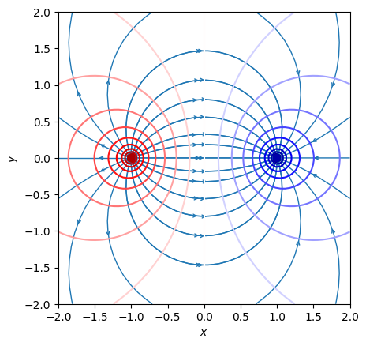
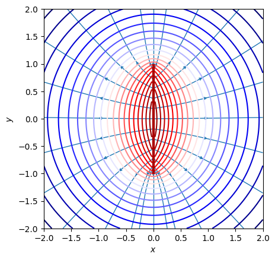
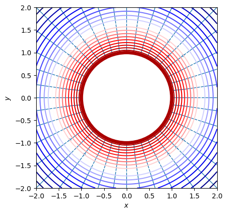
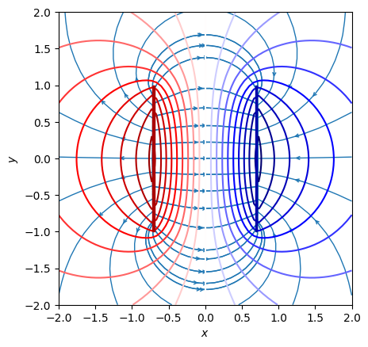
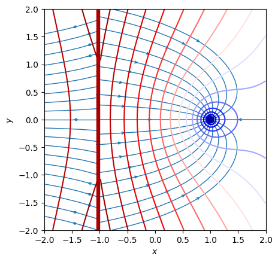

# 二维电磁场的基本理论

## 引言

电磁学具有悠久的研究历史。自1820年丹麦科学家汉斯·奥斯特发现电流产生磁场，开启了电磁学研究以来，1831年法拉第发现电磁感应现象，为电力应用奠定了基础。随后，麦克斯韦在1860年代提出电磁场理论，并预言了电磁波。1888年赫兹实验验证了电磁波的存在。20世纪初，电磁学与量子力学和相对论相结合，进一步推动了物理学的发展。迄今为止，三维电磁理论已经非常完善，几乎所有三维的电磁现象都可以用现有理论进行解释。

人类生活在三维空间，因此目前的电磁理论主要针对三维空间的，而对于二维空间的电磁理论研究很少。这一方面由于二维空间距离现实生活较远，对二维空间电磁理论的研究价值目前不如对三维空间的研究，另一方面则是由于人类无法进入二维空间进行实验，对于二维空间的理解不够深刻。然而，对于二维空间的电磁学研究在如下三个方面具有要意义：

一、人类有遭到“二向箔”攻击的可能。《三体》中描述的二向箔是一种超维度武器，能将三维空间压缩至二维平面，具有毁灭性效果。遭受攻击后，三维世界中的电磁现象将会发生变化，现有的三维电磁理论将不再使用，电子设备将失效，人类生活将受到严重影响。研究二维空间的电磁理论，有助于在受到二向箔攻击时，更快地重新构建电磁理论，设计新的电子设备，适应新的生存环境。因此，率先掌握二维电磁理论的国家或文明将更快地恢复生产力，得到领先优势。

二、人类有主动移民二维空间的可能。二维空间相比三维空间可能有消耗能量更低，资源更丰富，环境更稳定等优势。虽然目前没有科学证据支持这些说法，但也不能排除二维空间具有优越性的可能。因此未来人类有可能主动移民二维空间。在这种情况下，对二维电磁理论的研究将变得尤为重要，有助于人类更好地适应二维空间的生存环境，发展新的科技，推动文明进步。

三、人类有创造二维虚拟世界的可能。随着计算机技术的发展，人类有可能创造出二维虚拟世界，用于娱乐、教育、科研等领域。在二维虚拟世界中，电磁现象是虚拟的，但也需要有一套完整的电磁理论来描述。研究二维空间的电磁理论，有助于人类更好地理解二维虚拟世界中的电磁现象，设计更加逼真的虚拟环境，提高虚拟现实技术的水平。

因此，研究二维空间的电磁理论具有重要意义。由于无法直接进入二维空间进行实验，本研究主要采用纯理论推导的方式，构建了在基本性质上与当前人类所处的三维空间基本相同，且自洽的二维电磁场理论。包括了二维电磁场的叠加原理、二维静电场的高斯定理、二维静电场的环路定理、二维静电场的Poisson's Equation、二维电磁感应、二维电磁震荡等基本方程。并通过数值模拟，展示了二维电磁场的一些典型图像。

## 方法

### 基本方法

本研究考虑的二维空间为人类当前所处世界的二维情况，而非任意的二维空间。因此，本文所研究的二维空间在基本性质上与人类当前所处的三维空间一致，只是空间维数不同。如电磁学中的电荷、电场、磁场等基本概念在二维空间中的定义与三维空间中的定义相同。这样做的目的是为了保证我们的研究具有普适性，能够应用于人类当前所处的三维空间。

### 二维电磁场的叠加原理

三维电磁场中的叠加原理是指，多个电荷产生的电场在空间中产生的电场、电势可以直接相加。这体现了电场的线性性质。由于本文讨论的二维空间除空间维数与人类目前所处的三维空间不同以外，在不产生矛盾的情况下，应假设其他性质与三维空间相同。因此，二维空间中的电磁场也应满足叠加原理。

### 二维静电场的高斯定理

三维静电场中的高斯定理，是指通过闭合曲面的电通量与曲面内部电荷成正比的定律。该定理是电场的基本规律之一，应当具有普适性。在二维空间中，应当也存在与之对应的“二维静电场的高斯定理”。由于本文研究的二维空间在基本性质上与人类当前所处的三维空间相同，可以假设高斯定理在不可能与维数相关的部分仍然适用。即，通过闭合曲线的电通量仅与曲线内部电荷有关，而与曲线的具体形状和内部电荷分布情况无关：

$$
\oint_L \vec E\cdot d \bm{\vec n}=f(q)
$$

其中，$\vec E$ 为电场强度，$d \bm{\vec n}$ 为曲线上的微元法向量，$q$ 为曲线内部的电荷量，$f$ 为待定函数。

显然，在$q=0$的情况下，上式应当为0，即：

$$
f(0)=0
$$

另一方面，对于包含多个电荷的情况，由于电场满足叠加原理，应当有：

$$
\oint_L \vec E\cdot d \bm{\vec n}=\sum_i f(q_i)
$$

因此，$f$ 应当满足线性关系：

$$
f(q) = c_1 q
$$

故二维静电场的高斯定理即为：

$$
\oint_L \vec E\cdot d \bm{\vec n} = c_1 q
$$

其中，$L$ 为任意闭合曲线，$\vec E$ 为电场强度，$d \bm{\vec n}$ 为曲线上的微元法向量，$q$ 为曲线内部的电荷量，$c_1$ 为待定常数。$c_1$ 应由实验测量确定，不在本文的研究范围内。

### 二维静电场的环路定理

三维静电场中的环路定理是指，电场的环路积分为0。这体现了电场的无旋性质。在二维空间中，应当也存在与之对应的“二维静电场的环路定理”。作为基本性质，本文假设环路定理在不可能与维数相关的部分仍然适用。即，电场的环路积分为0：

$$
\oint_L \vec E\cdot d \bm{\vec n}=0
$$

其中，$L$为任意闭合曲线，$\vec E$为电场强度，$d \bm{\vec n}$为曲线上的微元法向量。

### 二维静电场的库伦定律

在二维静电场的高斯定理中，由于$L$任意，可取一个圆形的高斯“环”$L$，其圆心处有一个点电荷$q$。由于本文研究的二维空间应当也具有各向同性，点电荷 $q$ 在环上产生的电场的径向分量应当相同。故：

$$
\oint_L \vec E\cdot d \bm{\vec n}=E_r\cdot 2\pi r =c_1 q
$$

其中，$r$为圆的半径，$E_r$为点电荷在$r$处产生电场的径向分量。因此可以推出：

$$
E_r=\frac{c_1 q}{2\pi r} = \frac{k q}{r}
$$

即在二维静电场中，电场强度与电荷量成正比，与距离成反比。这与三维空间中的库伦定律中，电场强度与距离的平方成反比有所不同。

类似地，在圆环上应用二维静电场的环路定理，并考虑二维空间的各向同性，即电场的切向分量只可能处处相等的顺时针或逆时针分量，可以得：

$$
\oint_L \vec E\cdot d \bm{\vec n}=E_\theta\cdot 2\pi r =0
$$

故

$$
E_\theta=0
$$

即二维空间中点电荷产生电场强度的切向分量为 $0$。故二维空间中的库伦定律为：

$$
\vec E = E_r \bm{\hat r} = \frac{k q}{r} \bm{\hat r}
$$

### 二维静电场的泊松方程

将二维静电场的高斯定理转化为微分形式，得到：

$$
\nabla \cdot \vec E = c_1 \rho
$$

又由于二维静电场的环路定理，即二维静电场是无旋场，故存在标量场 $\phi(x,y)$ 使得：

$$
\vec E = -\nabla \phi
$$

由此可得二维静电场的泊松方程：

$$
\nabla^2 \phi = -c_1 \rho
$$

该方程描述了二维静电场中电势 $\phi$ 与电荷密度 $\rho$ 之间的关系。除常数 $c_1$ 可能与三维空间中不同外，二维静电场的泊松方程与三维空间中的泊松方程相同。

<!--
在二维中，我们依然想要让“电通量”只与其内部所包的电荷量有关。因为这将会关系到一个导体圆（对应于三维中的导体球）上电荷是否会自发分布在表面。导体圆在静电平衡时一定会内部处处电场为零，此时如果能够做到电通量只与内部所包的电荷量有关，那么取圆对称高斯面（如图），内部如果有电荷就会导致通量不为零，从而电场不为零，矛盾。

电通量只与内部包含电荷量有关就要求库伦的平方反比定律不再成立，代替它的是一次方反比关系。即：

$$
\vec E=k \frac{q \ \bm{\hat r}}{r}
$$

接下来我们以一次方反比为已知条件，推导高斯定理，

$$
d \Phi =k\frac{q \ \bm{\hat r}}{r} \cdot d \bm{\vec n}= kq\ (\frac{\bm{\hat r}\cdot d \bm{\vec n}}{r})
$$

这里$d \bm{\vec n}$是大小为$dl$,方向延外法线方向的矢量（如图）。

类比立体角，实际上我们也有平面角：

$$
d \theta=\frac{\bm{\hat r}\cdot d \bm{\vec n}}{r}
$$

所以

$$
d \Phi =kq\,d\theta\\
\Phi=\oint_L d \Phi=\oint_L kq\,d \theta=2\pi kq
$$
二维静电场高斯定理：
$$
\oint_L \vec E\cdot d \bm{\vec n}=c_1 q
$$

以上是对于包在内部的点电荷的推导，根据叠加原理可以得到内部有多个电荷的情形。另外，由于闭合曲线对外部一点所张平面角为0，所以外部电荷对电通量没有贡献。

左右同时变为二重积分就可以将高斯定理写成微分形式：
$$
\iint_D \nabla \cdot \vec E \ dS=c_1 \iint_D \rho\ dS\\
\implies\nabla \cdot \vec E=c_1 \rho
$$
需要注意的是，这里的c1在三维中是$\epsilon_0$，但并不重要。因为在创建虚拟世界的时候，这些参量都是认为设定的，取决于我们希望虚拟世界中的电磁相互作用强还是弱。

2. 二位静电场环路定理与Poisson's Equation

由于二维静电场依然是有心场，所以依然满足环路积分为0，也即存在标量场$\phi(x,y)$使得$\vec E=-\nabla \phi$，所以Poisson's Equation仍然成立：
$$
\nabla^2 \phi=-c_1\, \rho
$$

-->

### 二维静电场的模拟

图1 二维异号点电荷电场模拟

图2 二维有限长带电线电场模拟

图3 二维带电导体圆环电场模拟

图4 二维电容器电场模拟

图5 二维无限长带电线与点电荷电场模拟

### 二维电流

二维空间中的载流子，如二维电子，在空间中运动时即产生电流。二维空间中的电流密度应当与三维空间中的电流密度具有相同的定义。即，单位面积上的电流量与单位时间的比值。二维空间中的电流密度应当满足：

$$
\vec i = i_x \bm{\hat x} + i_y \bm{\hat y}
$$

而不存在 $j_z$ 分量。二维空间中电荷守恒定律应当成立，故电流密度应当满足电流连续性方程：

$$
\nabla \cdot \vec i = -\frac{\partial \rho}{\partial t}
$$

### 二维静磁场

二维静磁场和三维静磁场有显著的区别。在三维空间中，磁场是一个矢量场，每一点的磁场强度可能指向空间中的任何方向。而将此概念应用到二维空间中，会在三个方面产生问题：

- 二维空间中的电流无法产生方向处于平面内的磁场。不影响结论地，在三维中考虑一个平面作为研究的二维空间，则显然平面内的任何电流在平面内产生的磁场都没有平行于平面的分量，即，平面内的电流无法产生平行于平面的磁场。
- 假设二维空间中的电流于三维空间中的电流以相同的方式产生磁场，则二维空间中的磁场方向超出了二维空间的范围，无法在二维空间中以矢量的形式表示。
- 二维中的带电粒子在运动时，显然不可能受到第三个维度的力。若洛伦兹力仍然适用，方向在平面内的矢量磁场将会对平面中的带电粒子产生指向第三个维度的力，这是不合理的。

而将二维空间中的磁场以标量的形式表示，可以解决上述问题。在二维空间中，磁场的大小与方向均由一个标量表示。

该标量的正负号不会对二维电磁场的基本理论产生影响。方便起见，本文将二维空间中的磁场标量的正负号定义为：逆时针方向的正电流环在环内产生的磁场为正。

<!--
MOVE!

另一方面，受到二维点电荷电场模拟的启发，我们发现在二维中分析电磁场有一个手段，就是先将这个二维的电荷、电流分布在第三个维度上无穷地复制，得到一个三维中延z轴对称的分布的情况（如图）。由于对称性，三维中的电场不会存在z轴分量，刚好就是一个二维的矢量，对应二维的电场。二维中的任何一个线圈在经过上述复制后在三维看来都是一个无穷长螺线管，其内部磁场是均匀的，且只有z轴分量。
-->

首先，一个二维中的无穷长直导线在二维空间中产生的磁场是什么样的？这个问题可以用之前的“向三维复制”的思路解决。 我们事先规定：二维中正的磁场是指向三维复制之后磁场垂直纸面向里，二维中负的磁场是指向三维复制之后磁场垂直纸面向外。在三维来看，这是一个无穷大载流平面（如图）。取一个二维截面作为二维世界，这个无穷长载流导线产生的磁场是左边负，右边正的，左边，右边分别都是匀强磁场，而且左右磁场的绝对值相等。（如图）

如果加入更多的无限长直导线，会发现直导线的作用在于使得它左边区域的磁场减小一个定值，右边区域的磁场增加一个定值。由此可以想到，**电流直接影响的是磁场的梯度**。

类比三维中磁场的安培环路定理：
$$
\oint_{\partial S} \vec B \cdot d \vec l=\mu_0 \iint_S \vec j \cdot d \vec S
$$
得到二维磁场中的“跨路”定理：
$$
B(\bm r_2)-B(\bm r_1)=c_2 \int_{\bm r_1}^{\bm r_2} \vec i \cdot d \vec{\bm n}
$$
（如图）

三维：
$$
    电场高斯定理：电场二维积分\to电荷三维积分\\
    磁场环路定理：磁场一维积分\to电流二维积分
$$
二维：
$$
\begin{align}
    &电场高斯定理：电场一维积分\to电荷二维积分\\
    &磁场跨路定理：磁场零维积分\to电流一维积分？？？
\end{align}
$$

实际上，上式左侧确实是一个“零维积分”！

在三维中，接下来可以把磁场的一维积分转化为其旋度的二维积分从而得到磁场的旋度方程：
$$
\iint_S (\nabla \times \vec B) \ \cdot d \vec S=\oint_{\partial S} \vec B \cdot d \vec l=\mu_0\iint_S \vec j \cdot d \vec S\\
\implies \nabla \times \vec B=\mu_0 \vec j
$$
类似地对跨路定理进行操作：
$$
\int_{\bm r_1}^{\bm r_2}\nabla B \cdot d \vec l=B(\bm r_2)-B(\bm r_1)=c_2\int_{\bm r_1}^{\bm r_2} \vec i \cdot d \vec{\bm n}\\
注意:这里需要额外规定d \vec{\bm n}指向积分方向的左手边\\
\implies \nabla B=c_2\, M\,\vec i\\
其中M=
\begin{bmatrix}
0 & -1 \\
1 & 0 \\
\end{bmatrix}
是逆时针转90 \degree 的矩阵
$$
与$c_1$相同，这里的$c_2$也是一个待定的常数。

这里补充磁场的Biot-Savart定律：
$$
d \vec B=k\frac{I\cdot[(dl)_y(\hat {\bm r})_x-(dl)_x(\hat {\bm r})_y]}{r}
$$
可以证明此Biot-Savart定律与跨路定理微分形式是自洽的。

磁场模拟：

（如图）

（如图）

5. 洛伦兹力

带电粒子在电磁场中的受力公式：
$$
\vec F=q(\vec E+B\cdot M \vec v)
$$

6. 电磁感应

7. 电磁震荡

考虑到电磁感应现象，我们将方程改写成如下形式：
$$
    \begin{align}
        &\nabla \cdot \vec E=c_1 \cdot \rho
        \\
        &\frac{\partial E_y}{\partial x}-\frac{\partial E_x}{\partial y}=\lambda_1\frac{\partial B}{\partial t}\\
        &\nabla B=M(c_2\,\vec i+\lambda_2 \frac{\partial \vec E}{\partial t})
    \end{align}\\
$$
注意：这里将M写在括号外面，对电场也进行一个旋转是必要的，否则无法得到正常的电磁振荡形式。

在真空中：$\rho\,$与$\,\vec i\,$取成0得到方程组：
$$

\begin{align}
    &\nabla \cdot \vec E=0
    \\
    &\frac{\partial E_y}{\partial x}-\frac{\partial E_x}{\partial y}=\lambda_1\frac{\partial B}{\partial t}\\
    &\nabla B=M\lambda_2 \frac{\partial \vec E}{\partial t}
\end{align}\\
$$

$1\degree \quad $一方面，对()式两边取梯度：
$$
\frac{\partial}{\partial x}(\frac{\partial E_y}{\partial x}-\frac{\partial E_x}{\partial y})\hat x+\frac{\partial}{\partial y}(\frac{\partial E_y}{\partial x}-\frac{\partial E_x}{\partial y})\hat y=\lambda_1\frac{\partial (\nabla B)}{\partial t}\\=\lambda_1\frac{\partial}{\partial t}(M\lambda_2 \frac{\partial \vec E}{\partial t})=\lambda_1\lambda_2\frac{\partial^2}{\partial t^2}(-E_y\hat x+E_x\hat y)
$$

$$
x分量相等\implies \frac{\partial}{\partial x}(\frac{\partial E_y}{\partial x}-\frac{\partial E_x}{\partial y})=\frac{\partial^2 E_y}{\partial x^2}-\frac{\partial^2 E_x}{\partial x \partial y}=-\lambda_1\lambda_2\frac{\partial^2 E_y}{\partial t^2}
$$

根据()式，有：
$$
\frac{\partial^2 E_x}{\partial x \partial y}=\frac{\partial}{\partial y}(\frac{\partial E_x}{\partial x})=\frac{\partial}{\partial y}(-\frac{\partial E_y}{\partial y})=-\frac{\partial^2 E_y}{\partial y^2}
$$
于是得到了E_y的波动方程：
$$
\nabla^2 E_y+\lambda_1\lambda_2\frac{\partial^2 E_y}{\partial t^2}=0
$$
同理考虑y分量相等我们得到了E_x的波动方程：
$$
\nabla^2 E_x+\lambda_1\lambda_2\frac{\partial^2 E_x}{\partial t^2}=0
$$
综合起来有：
$$
\nabla^2 \vec E+\lambda_1\lambda_2\frac{\partial^2\vec E}{\partial t^2}=\vec 0
$$

$2\degree \quad$另一方面，对()式两边取散度：
$$
\nabla \cdot \nabla B=\nabla^2 B=\lambda_2[\frac{\partial}{\partial x}(M\frac{\partial \vec E}{\partial t})_x+\frac{\partial}{\partial y}(M\frac{\partial \vec E}{\partial t})_y]=\lambda_2 \frac{\partial}{\partial t}(-\frac{\partial E_y}{\partial x}+\frac{\partial E_x}{\partial y})=-\lambda_1\lambda_2 \frac{\partial^2 B}{\partial t^2}
$$

也即:

$$
\nabla^2 B+\lambda_1\lambda_2\frac{\partial^2 B}{\partial t^2}=0
$$

二维电磁波传播的速度为：

$$
u=\frac{1}{\sqrt{-\lambda_1\lambda_2}}
$$

（补充电磁振荡动图）

## 结论

二维电磁场与三维

## 讨论

本文在人类当前所处世界的二维情况下建立了自洽的电磁学理论。这一理论的基础在于假设本文所研究的二维空间在基本性质上与三维空间相同，但在可能与维数相关的部分认为三维空间的电磁理论可能不再成立。这一假设具有较高的合理性，因为它在尽可能接近人类当前所处世界的情况下，构建了一个与三维空间电磁理论相对应的自洽的二维电磁理论。这与从任意基本假设出发，仅以满足自洽性作为目标构建的电磁理论有本质不同，本理论对于人类更具有实用性，对于人类可能遭受“二向箔”攻击、主动移民二维空间、创造二维虚拟世界等情况具有重要意义。

由于无法进入二维空间进行实验，亦不能确定不同的二维空间是否会有不同的物理学常量，本文没有给出各电磁学常量的具体数值。这一问题需要进一步的实验研究来解决。

由于无法确保人类未来只可能进入满足本文假设的二维空间，本文所给出的电磁理论只适用于人类有更大可能进入的二维空间。对于其他可能的二维空间，需要进一步的研究来确定其电磁理论。

## 参考文献

## 致谢

## 附录

代码之类的
